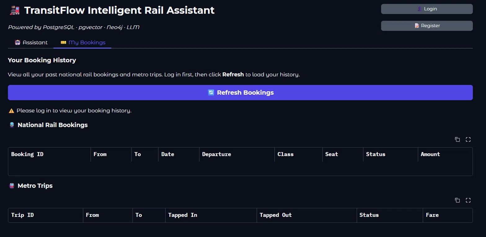
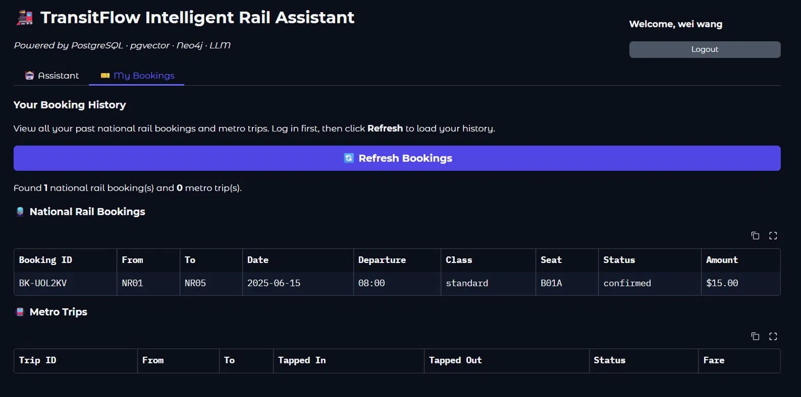

# Team22 — TransitFlow Database Design Document

**Group:** 22  
**Members:** 張學睿 (ds0w0), 陸昱霖 (chocomint408), 王宇崴 (yikes0000)

---

## Section 1 — Entity-Relationship Diagram

> **Owner: ds0w0**

<!-- Insert ER diagram here (dbdiagram.io / draw.io / Lucidchart export) -->
<!-- Required: all entities, cardinality labels on diagram lines, PKs, FKs, 2-3 data attributes per entity -->

---

## Section 2 — Normalisation Justification

> **Owner: ds0w0**

<!-- Required:
  - At least one 2NF or 3NF design decision with functional dependency explanation
  - At least one deliberate de-normalisation trade-off (or justification for full normalisation)
  - Password hashing: algorithm chosen, why selected over MD5/SHA-1, how salt is managed
  - Correct use of database terminology
-->

---

## Section 3 — Graph Database Design Rationale

> **Owner: chocomint408**

<!-- Required:
  - What data is stored as nodes, relationships, and properties — with justification
  - Why graph DB is better than relational for routing (concrete algorithmic argument)
  - At least two query types described (e.g. shortest path + interchange path)
  - Node identity: which property uniquely identifies nodes and why
-->

---

## Section 4 — Vector / RAG Design

> **Owner: yikes0000**

### 4.1 What is Embedded and Why

TransitFlow embeds **policy documents** into the `policy_documents` table using the pgvector extension in PostgreSQL. Each document covers a distinct operational topic — refund policies, ticket types, booking rules, and travel regulations (bicycles, pets, luggage, conduct, lost property, disruptions, penalty fares, group bookings, children's fares, season passes, and special services).

Documents are sourced from four JSON files in `train-mock-data/`:

| Source File | Categories | Documents |
|-------------|-----------|-----------|
| `refund_policy.json` | refund | 5 |
| `ticket_types.json` | booking | 3 |
| `booking_rules.json` | booking | 3 |
| `travel_policies.json` | conduct | 10 |
| **Total** | | **21** |

Each document is stored as a `(title, category, content, embedding, source_file)` row. The `embedding` column holds a fixed-dimension float vector produced by the configured embedding model.

---

### 4.2 Why Cosine Similarity is Appropriate

The system uses **cosine similarity** to measure the relevance of a policy document to a user's query. Cosine similarity measures the angle between two vectors in the embedding space, not their magnitude. This is the correct choice for semantic text search for two reasons:

**Magnitude independence:** Two documents that cover the same topic will point in the same direction in the embedding space, regardless of length. A short two-sentence policy summary and a long detailed regulation will have similar cosine similarity to a matching query, even though their vector magnitudes differ significantly. Using Euclidean distance instead would penalise longer documents simply because they have larger magnitude vectors — not because they are less relevant.

**Directional semantic meaning:** Embedding models are trained to encode semantic meaning as direction. Words and phrases with similar meaning cluster in the same region of the embedding space. Cosine similarity directly exploits this property: a query like "can I get money back for a late train?" will have a high cosine similarity with the delay compensation policy document because both point toward the same semantic region, even though they share no exact words.

In pgvector, cosine similarity is computed using the `<=>` operator (cosine distance), and similarity score is derived as:

```sql
1 - (embedding <=> query_vector::vector) AS similarity
```

A score of 1.0 means the vectors point in exactly the same direction (identical meaning). A score of 0.0 means they are orthogonal (unrelated).

---

### 4.3 The Full RAG Pipeline

The TransitFlow RAG pipeline operates in four stages every time a policy question is received:

#### Stage 1 — Query Embedding
The user's natural language question is converted into a vector using the same embedding model used to embed the documents at seeding time. This is critical: if the query and documents use different models, the vectors live in different spaces and similarity scores are meaningless.

```python
# skeleton/llm_provider.py
query_vector = llm.embed("can I get a refund for a delay?")
# Returns a list of 768 floats (Ollama) or 3072 floats (Gemini)
```

#### Stage 2 — Similarity Search
The query vector is compared against all stored document embeddings using cosine similarity. Only documents above a minimum similarity threshold (`VECTOR_SIMILARITY_THRESHOLD`) are returned, ordered by relevance.

```python
# databases/relational/queries.py
sql = """
    SELECT title, category, content,
           1 - (embedding <=> %s::vector) AS similarity
    FROM policy_documents
    WHERE 1 - (embedding <=> %s::vector) > %s
    ORDER BY embedding <=> %s::vector
    LIMIT %s
"""
```

A HNSW index on the `embedding` column (`idx_policy_documents_embedding`) ensures this search is fast even as the document count grows.

#### Stage 3 — Retrieved Documents Passed to LLM
The top-K most similar documents (default: top 3) are retrieved and their content is injected into the LLM prompt as context. The agent formats these as a `DATA FROM TRANSITFLOW DATABASE` block so the LLM treats them as ground truth.

#### Stage 4 — LLM Generates Answer
The LLM reads the user's question alongside the retrieved policy content and generates a natural language answer grounded in the actual policy data. Because the LLM is instructed to use only the retrieved data, it cannot hallucinate policies that do not exist in the database.

**Pipeline summary:**

```
User question
     │
     ▼
[Stage 1] llm.embed(question) → query_vector
     │
     ▼
[Stage 2] cosine similarity search → top-K policy documents
     │
     ▼
[Stage 3] documents injected into LLM prompt as context
     │
     ▼
[Stage 4] LLM generates grounded answer
     │
     ▼
Answer returned to user
```

---

### 4.4 Embedding Dimension and Provider Switching

The embedding dimension is determined by the model used:

| Provider | Model | Dimension |
|----------|-------|-----------|
| Ollama (default) | `nomic-embed-text` | **768** |
| Gemini | `gemini-embedding-001` | **3072** |

The schema defines the vector column as:

```sql
embedding vector(768)  -- Ollama default
```

**What happens if the provider is switched after seeding:**

If documents are seeded using Ollama (768 dimensions) and the provider is later switched to Gemini (3072 dimensions), the new query embeddings will have 3072 dimensions while the stored document embeddings have 768 dimensions. PostgreSQL will reject the comparison with a dimension mismatch error, making the entire vector search index unusable.

To switch providers safely, the database must be reset and all documents re-seeded with the new model:

```bash
# 1. Reset the database
docker-compose down -v && docker-compose up -d

# 2. Change OLLAMA_EMBED_DIM or switch LLM_PROVIDER in .env

# 3. Re-seed all policy documents with the new model
python skeleton/seed_vectors.py
```

The `schema.sql` comment explicitly documents this constraint:

```sql
-- 768-dim  → Ollama nomic-embed-text (default)
-- 3072-dim → Gemini gemini-embedding-001
-- If you switch LLM_PROVIDER to gemini, change to vector(3072) and reset the database.
```

This is a fundamental property of vector databases: all vectors in a collection must share the same dimensionality and must have been produced by the same model. Mixing providers or models after seeding produces a broken index that cannot be repaired without a full re-seed.

---

## Section 5 — AI Tool Usage Evidence

> **Owner: ds0w0**

<!-- Required: 3–5 examples, each with Context + Prompt + Outcome
  - At least one example where AI output was wrong and needed correction
  - Prompts must be specific and purposeful
-->

---

## Section 6 — Reflection & Trade-offs

> **Owner: chocomint408**

<!-- Required:
  - At least two specific design decisions with clear reasoning
  - One aspect that would be different in a production system
-->

---
## Section 7 — Task 6 Extension: Trip History Panel

> **Owner: yikes0000**

---

### 7.1 Motivation

The original TransitFlow UI is entirely chat-based. All data — schedules, fares, bookings, and policies — is returned as plain text inside the conversation window. This creates two problems for booking history specifically:

1. **Not persistent:** A user asking "show my bookings" receives a one-time text reply that scrolls away as the conversation continues. There is no way to refer back to past bookings without asking again.
2. **Not scannable:** A list of bookings formatted as a chat reply is harder to read than a table with clearly labelled columns.

The **My Bookings** tab solves both problems by providing a dedicated, persistent, tabular view of the user's booking history queried directly from PostgreSQL. It adds a genuinely new interaction mode that the chat interface cannot replicate — the user can check their bookings at any time without typing a message or involving the LLM at all.

This extension qualifies for the full database extension bonus (not UI-only) because it queries live data from two PostgreSQL tables (`national_rail_bookings` and `metro_travel_history`) via the existing `query_user_bookings()` function.

---

### 7.2 Files Modified

| File | Change |
|------|--------|
| `skeleton/ui.py` | Added `load_trip_history()` function and `🎫 My Bookings` tab with two `gr.Dataframe` tables and a Refresh button |
| `train-mock-data/travel_policies.json` | Extended with 4 new top-level policy sections: `children_and_family`, `passenger_conduct`, `season_tickets_and_passes`, `special_services`. Fixed JSON structure (moved `penalty_fares` and `group_bookings` out of `planned_disruptions` to top-level). Total policy documents increased from 15 to 21. |

---

### 7.3 New Function: `load_trip_history()`

Added to `skeleton/ui.py`. Calls `query_user_bookings()` from `databases/relational/queries.py` and formats the results into two table-ready lists.

```python
def load_trip_history(current_user: str):
    """
    Fetch the logged-in user's booking history from PostgreSQL and format it
    as two separate Gradio Dataframe-compatible lists (national rail + metro).
    """
    if not current_user:
        return ([], [], gr.update(value="⚠️ Please log in to view your booking history.", visible=True))

    bookings = query_user_bookings(current_user)

    rail_rows = []
    for b in bookings.get("national_rail", []):
        rail_rows.append([
            b.get("booking_id", ""),
            b.get("origin_station_id", ""),
            b.get("destination_station_id", ""),
            b.get("travel_date", ""),
            b.get("departure_time", ""),
            b.get("fare_class", ""),
            b.get("seat_id", ""),
            b.get("status", ""),
            f"${b.get('amount_usd', 0):.2f}",
        ])
    ...
```

---

### 7.4 Database Tables Queried

The extension queries two existing PostgreSQL tables via `query_user_bookings()`:

**`national_rail_bookings`**
```sql
SELECT booking_id, schedule_id, origin_station_id, destination_station_id,
       travel_date, departure_time, ticket_type, fare_class, coach, seat_id,
       stops_travelled, amount_usd, status, booked_at, travelled_at
FROM national_rail_bookings
WHERE user_id = %s
ORDER BY booked_at DESC;
```

**`metro_travel_history`**
```sql
SELECT trip_id, user_id, schedule_id, origin_station_id, destination_station_id,
       tap_in_at, tap_out_at, fare_usd, status
FROM metro_travel_history
WHERE user_id = %s
ORDER BY tap_in_at DESC;
```

No new tables or schema changes were required — the extension surfaces data that already exists in the relational database.

---

### 7.5 Example Query and Output

Calling `query_user_bookings('weiwng613@gmail.com')` for a user with one confirmed national rail booking returns:

```python
{
    "national_rail": [
        {
            "booking_id": "BK-UOL2KV",
            "origin_station_id": "NR01",
            "destination_station_id": "NR05",
            "travel_date": "2025-06-15",
            "departure_time": "08:00",
            "fare_class": "standard",
            "seat_id": "B01A",
            "status": "confirmed",
            "amount_usd": 15.0
        }
    ],
    "metro": []
}
```

This is displayed in the UI as a formatted table row under **National Rail Bookings**.

---

### 7.6 Testing Evidence

**Figure 1 — Unauthenticated state:** When a user clicks Refresh without logging in, the panel shows a warning message and both tables remain empty.



**Figure 2 — Authenticated state with booking data:** After logging in as `wei wang` and clicking Refresh, the panel shows 1 national rail booking (`BK-UOL2KV`, NR01 → NR05, 2025-06-15, standard class, seat B01A, $15.00, confirmed).



> **Note:** Screenshots above show the live running application querying PostgreSQL directly. The booking was created via `execute_booking()` and is confirmed present in the `national_rail_bookings` table.

---

### 7.7 RAG Knowledge Base Extension

In addition to the UI panel, the policy knowledge base was expanded by extending `train-mock-data/travel_policies.json` with 4 new sections:

| New Section | Content |
|-------------|---------|
| `children_and_family` | Children's fares (under 5 free, ages 5–15 half fare), pushchair rules, family coach |
| `passenger_conduct` | General behaviour, photography, busking, intoxication policy, mobile phone use |
| `season_tickets_and_passes` | Metro day pass ($8.50), weekly pass ($32.00), national rail monthly pass ($180.00), combined pass ($55.00) |
| `special_services` | Night services (Fri/Sat only on Lines 1–3), express surcharge ($3.50), charter services |

This increased the total embedded policy documents from **15 to 21**, allowing the RAG assistant to answer questions about children's fares, night services, season passes, and passenger conduct rules that were previously outside its knowledge base.

**Example — before extension:**
> Q: "Is there a night service on Friday?"
> A: No information found.

**Example — after extension:**
> Q: "Is there a night service on Friday?"
> A: Yes — night metro services run on Friday and Saturday nights only, every 30 minutes between 00:00 and 05:00 on Lines 1, 2, and 3.
